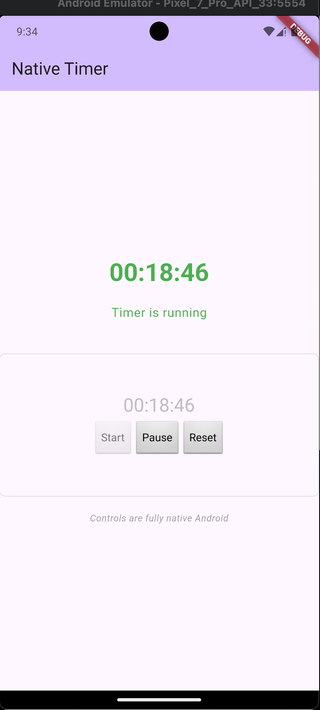

# Native Timer - Flutter & Android Native UI Integration POC


## 📋 Overview

**Native Timer** is a Proof of Concept (POC) demonstrating the integration of **native Android UI components** within a Flutter application. This project showcases how to:

- Embed native Android views (created with Kotlin) into Flutter layouts using `AndroidView`
- Establish communication between Flutter Dart code and native Android code via `MethodChannel`
- Implement a background service (`TimerService`) for timer operations
- Manage state synchronization between native and Flutter layers
- Display real-time updates from native components in Flutter UI

This POC proves that Flutter applications can seamlessly integrate native platform-specific UI when needed, combining the best of both worlds.

---

## 📸 Screenshots

The application displays a dual-layer interface with both Flutter and native Android components:



**Key Elements in the Screenshot:**
- **Top Section (Flutter)**: Displays the timer in large green text with status indicator
- **Bottom Section (Native Android)**: Shows the same timer time with three control buttons (Start, Pause, Reset)
- **Real-time Synchronization**: Both sections update simultaneously as the timer runs
- **Status Display**: "Timer is running" text indicates the current state with color feedback

---

## 🎯 Project Purpose

The main goal of this project is to demonstrate a **proof of concept** for using **native Android UI components** within Flutter. Instead of using only Flutter widgets, this application:

1. **Creates native Android components** (buttons, text views, layouts) in Kotlin
2. **Embeds them in Flutter** using the `AndroidView` platform view widget
3. **Communicates bidirectionally** between Flutter and native code
4. **Manages background services** with a native Android service
5. **Provides real-time updates** from the native layer to the Flutter UI

---

## ✨ Key Features

### 🔄 Flutter-Android Communication
- **MethodChannel** for calling native functions from Dart
- **Callback handlers** for native code to notify Flutter of updates
- Seamless data exchange between layers

### ⏱️ Timer Management
- Start, pause, and reset timer controls
- Real-time elapsed time tracking
- Background service implementation for persistent timing

### 📱 Native Android UI
- Fully native Android buttons and layouts
- Direct interaction with native components
- Integration with Android's `LinearLayout`, `Button`, and `TextView`

### 🔔 System Integration
- Foreground service with notifications
- Notification channel creation for Android 8.0+
- System-level timer state management

### 📊 Dual State Display
- Flutter UI showing timer status
- Native Android UI with full controls
- Synchronized state between both layers

---

## 🏗️ Architecture

### Project Structure

```
native_timer/
├── lib/
│   └── main.dart                          # Flutter UI & entry point
├── android/app/src/main/kotlin/
│   ├── MainActivity.kt                    # Flutter activity & platform view registration
│   ├── TimerService.kt                    # Background service for timer logic
│   ├── NativeTimerView.kt                 # Native Android UI implementation
│   └── NativeTimerViewFactory.kt          # Factory for creating native views
├── pubspec.yaml                           # Flutter dependencies
└── README.md                              # This file
```

### Component Interaction Flow

```
┌─────────────────────────────────────────────────────────────┐
│                    Flutter Layer (Dart)                      │
│                                                              │
│  ┌────────────────────────────────────────────────────────┐ │
│  │  main.dart - NativeTimerPage UI                        │ │
│  │  - Displays timer text                                 │ │
│  │  - Shows running status                                │ │
│  │  - Embeds AndroidView platform view                    │ │
│  └────────────────────────────────────────────────────────┘ │
│           ▲                                    │              │
│           │ onTimerUpdate callback            │ invokes      │
│           │ (real-time updates)               │ actions      │
│           │                                    ▼              │
│  ┌────────────────────────────────────────────────────────┐ │
│  │    MethodChannel: com.example.native_timer/timer       │ │
│  └────────────────────────────────────────────────────────┘ │
└─────────────────────────────────────────────────────────────┘
                           │
                           │ IPC (Inter-Process Communication)
                           │
┌─────────────────────────────────────────────────────────────┐
│                  Android Native Layer (Kotlin)               │
│                                                              │
│  ┌────────────────────────────────────────────────────────┐ │
│  │  MainActivity.kt                                        │ │
│  │  - Registers platform view factory                     │ │
│  │  - Manages method channel                              │ │
│  └────────────────────────────────────────────────────────┘ │
│           ▲                                    │              │
│           │ addListener                        │ startTimer   │
│           │ removeListener                     │ pauseTimer   │
│           │                                    │ resetTimer   │
│  ┌─────────┴────────────────────────────────────┴──────────┐ │
│  │  NativeTimerView.kt                                     │ │
│  │  - Displays native UI (buttons, text)                   │ │
│  │  - Handles button clicks                               │ │
│  │  - Implements TimerListener interface                  │ │
│  └─────────┬────────────────────────────────────┬──────────┘ │
│           │ listens to updates                  │ sends       │
│           │                                    │ commands    │
│  ┌─────────▼────────────────────────────────────▼──────────┐ │
│  │  TimerService.kt                                        │ │
│  │  - Background service (runs independently)              │ │
│  │  - Manages timer logic (start/pause/reset)              │ │
│  │  - Maintains elapsed time state                         │ │
│  │  - Manages foreground notifications                     │ │
│  │  - Notifies listeners of timer updates                  │ │
│  └────────────────────────────────────────────────────────┘ │
│                                                              │
└─────────────────────────────────────────────────────────────┘
```

---

## 🚀 Getting Started

### Prerequisites

- **Flutter SDK**: >= 3.3.0
- **Android SDK**: API level 21+
- **Kotlin**: 1.7+
- **Xcode** (for iOS, optional)

### Installation

1. **Clone the repository**
   ```bash
   git clone <repository-url>
   cd native_timer
   ```

2. **Install Flutter dependencies**
   ```bash
   flutter pub get
   ```

3. **Build Android project**
   ```bash
   cd android
   ./gradlew clean build
   cd ..
   ```

4. **Run the application**
   ```bash
   # On Android device/emulator
   flutter run -d android
   ```

---

## 📱 Usage

### Running the Timer

The application provides a full-featured timer interface with both Flutter and native Android controls:

1. **Press the Start button** to begin the timer
2. **Press Pause** to pause the timer
3. **Press Reset** to clear the timer

The timer will:
- Update in real-time in the Flutter UI
- Display the elapsed time in the native Android view
- Show a system notification while running
- Synchronize state between both layers automatically

### UI Components

#### Flutter UI (Top Section)
- **Timer Display**: Shows the current elapsed time in HH:MM:SS format
- **Status Text**: Indicates whether the timer is running or stopped
- **Status Color**: Green when running, grey when stopped

#### Native Android UI (Bottom Section)
- **Time Display**: Redundant display of elapsed time in native Android TextView
- **Start Button**: Initiates the timer (disabled when running)
- **Pause Button**: Pauses the timer (disabled when stopped)
- **Reset Button**: Resets the timer to 00:00:00

---

## 🔧 Architecture Details

### 1. Flutter Layer (`main.dart`)

```dart
// Establishes communication channel
static const platform = MethodChannel('com.example.native_timer/timer');

// Listens for native callbacks
platform.setMethodCallHandler(_handleMethodCall);

// Updates UI based on native events
setState(() {
  _timeText = args['timeText'];
  _isRunning = args['isRunning'];
});
```

**Responsibilities:**
- Define the UI layout
- Embed the native Android view
- Listen for timer updates from native layer
- Display current time and status

### 2. Android Native Layer

#### `MainActivity.kt`
- Registers the platform view factory
- Sets up the MethodChannel for communication
- Acts as the bridge between Flutter and native code

#### `NativeTimerView.kt`
- Creates the native Android UI components
- Manages lifecycle of native view
- Implements `TimerListener` interface
- Updates UI when timer changes
- Calls native `TimerService` methods when buttons are pressed
- Notifies Flutter of changes via `MethodChannel`

#### `TimerService.kt`
- Background service managing actual timer logic
- Uses `Timer` and `Handler` for accurate timing
- Maintains listener list for UI updates
- Creates and manages foreground notifications
- Provides public methods: `startTimer()`, `pauseTimer()`, `resetTimer()`

#### `NativeTimerViewFactory.kt`
- Factory pattern implementation
- Creates instances of `NativeTimerView`
- Registers with Flutter's platform view system

### 3. Communication Flow

**Starting the Timer:**
```
User clicks "Start" button (native)
    ↓
NativeTimerView.startTimerService() called
    ↓
Intent sent to TimerService with ACTION_START
    ↓
TimerService.startTimer() runs timer logic
    ↓
Timer tick every second
    ↓
TimerService.notifyListeners() called
    ↓
NativeTimerView.onTimerUpdate() invoked
    ↓
NativeTimerView updates native UI (TextView, Button states)
    ↓
NativeTimerView.channel.invokeMethod("onTimerUpdate", data)
    ↓
Flutter receives callback in _handleMethodCall()
    ↓
setState() updates Flutter UI
```

---

## 🎓 Key Concepts Demonstrated

### 1. **Platform Channels**
Communication between Flutter (Dart) and native Android (Kotlin) using `MethodChannel`.

**Flutter side:**
```dart
final result = await platform.invokeMethod('someAction');
platform.setMethodCallHandler(_handleNativeCallback);
```

**Android side:**
```kotlin
channel.invokeMethod("onTimerUpdate", mapOf(
    "timeText" to timeText,
    "isRunning" to isRunning
))
```

### 2. **Platform Views**
Embedding native Android views directly in Flutter using `AndroidView` widget.

```dart
AndroidView(
  viewType: 'NativeTimerView',
  layoutDirection: TextDirection.ltr,
  creationParams: {},
  creationParamsCodec: StandardMessageCodec(),
)
```

### 3. **Service Architecture**
Implementing Android background services for long-running operations.

- Service runs independently of UI lifecycle
- Uses `startForeground()` with notifications to keep service alive
- Maintains state across app restarts

### 4. **Listener Pattern**
Event-driven architecture with listener callbacks for state changes.

```kotlin
interface TimerListener {
    fun onTimerUpdate(seconds: Int, isRunning: Boolean)
}
```

### 5. **View Factory Pattern**
Decoupling view creation from view usage.

```kotlin
class NativeTimerViewFactory(private val channel: MethodChannel) 
    : PlatformViewFactory(StandardMessageCodec.INSTANCE) {
    override fun create(context: Context, viewId: Int, args: Any?): PlatformView {
        return NativeTimerView(context, channel)
    }
}
```

---

## 🔐 Permissions Required

The following permissions are declared in `AndroidManifest.xml`:

- `FOREGROUND_SERVICE` - Required for background timer service
- `POST_NOTIFICATIONS` - Required for showing notifications (Android 13+)

---

## 📊 State Management

### Timer State
- **elapsedSeconds**: Current elapsed time in seconds
- **isRunning**: Boolean flag indicating if timer is active

### UI Synchronization
The state is synchronized through:
1. **Native TimerService** maintains ground truth
2. **NativeTimerView** listens for changes and updates native UI
3. **NativeTimerView** invokes MethodChannel callback
4. **Flutter** receives callback and updates display

---

## 🧪 Testing Recommendations

### Unit Tests
- Test time formatting logic
- Test timer calculations (hours, minutes, seconds conversion)

### Integration Tests
- Test native-Flutter communication via MethodChannel
- Test UI updates when timer changes
- Test service lifecycle (start, pause, reset)

### Manual Testing
- Verify timer increments correctly
- Test pause and resume functionality
- Verify UI updates in real-time
- Check notification display during timer operation
- Test orientation changes while timer is running

---

## 🐛 Troubleshooting

### Timer Not Starting
- Ensure `TimerService` is properly declared in `AndroidManifest.xml`
- Check that foreground service permission is granted
- Verify MethodChannel communication is working

### Native UI Not Displaying
- Check that `NativeTimerViewFactory` is registered in `MainActivity`
- Ensure `viewType` matches between Flutter and Android code
- Verify `AndroidView` widget is properly nested in a sized container

### Updates Not Reaching Flutter
- Verify `MethodChannel` name matches on both sides
- Check that `setMethodCallHandler` is called in Flutter's `initState`
- Ensure listener is being added to the service

---

## 🎯 Use Cases for Native UI in Flutter

This POC demonstrates techniques useful for:

1. **Complex Custom Animations** - Implement in native for better performance
2. **Native Look & Feel** - Use platform-specific UI patterns
3. **Hardware Integration** - Access device-specific APIs
4. **Performance-Critical Components** - Use native code for intensive operations
5. **Legacy Integration** - Embed existing native components
6. **Platform Plugins** - Build custom platform-specific functionality

---

## 🚀 Advanced Customizations

### Modify Timer Service
Edit `TimerService.kt` to:
- Add different timer modes (countdown, stopwatch, intervals)
- Customize notification appearance
- Add sound/vibration alerts
- Implement different display formats

### Customize Native UI
Edit `NativeTimerView.kt` to:
- Change button styling and layout
- Add more controls (lap timer, split timer)
- Implement custom animations
- Add accessibility features

### Enhance Flutter UI
Edit `main.dart` to:
- Add more visual indicators
- Implement sound effects
- Add history/stats display
- Create presets for common durations

---

## 📚 Dependencies

- **flutter**: Flutter SDK
- **flutter_local_notifications** (^18.0.1): For notification management
- **Kotlin**: 1.7+
- **AndroidX**: Latest stable

---

## 🤝 Contributing

This is a POC project. Feel free to:
- Extend functionality
- Add new features
- Improve error handling
- Optimize performance

---

## 📝 License

This project is open source and available under the MIT License.

---

## 📞 Support

For questions or issues related to this POC, refer to:
- [Flutter Platform Channels Documentation](https://docs.flutter.dev/development/platform-integration/platform-channels)
- [Android Services Documentation](https://developer.android.com/guide/components/services)
- [Platform Views Documentation](https://docs.flutter.dev/development/platform-integration/android/platform-views)

---

## 🎉 Summary

**Native Timer** is a comprehensive example of how to seamlessly integrate native Android UI components within a Flutter application. It demonstrates best practices for:

✅ Cross-platform communication  
✅ Background service implementation  
✅ Platform view integration  
✅ State synchronization  
✅ Listener-based event handling  

This POC provides a solid foundation for building hybrid Flutter applications that leverage native capabilities when needed.

---

**Happy Coding! 🚀**
